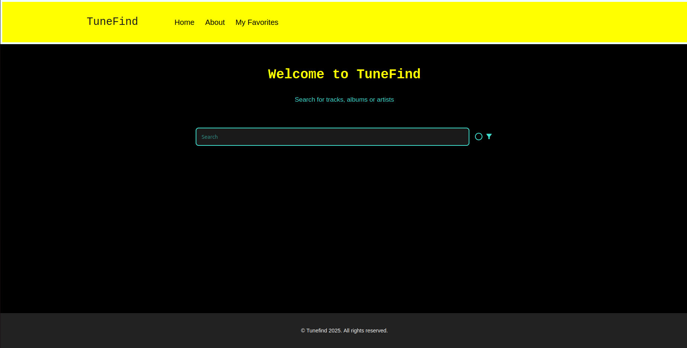
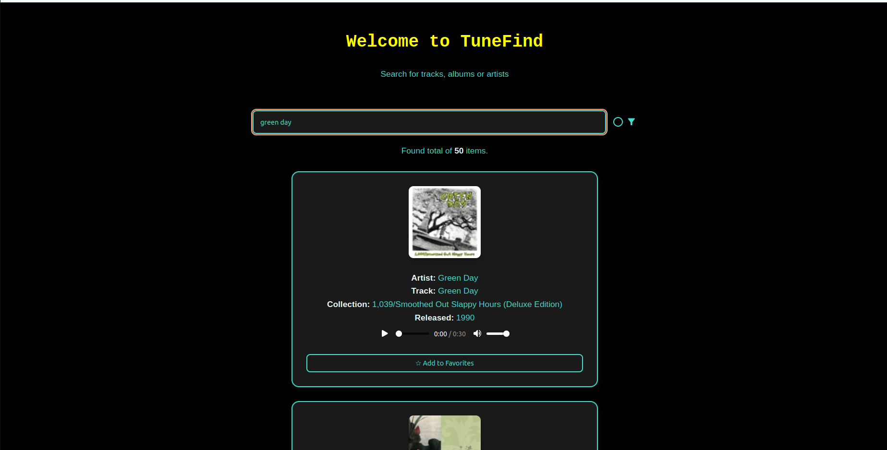
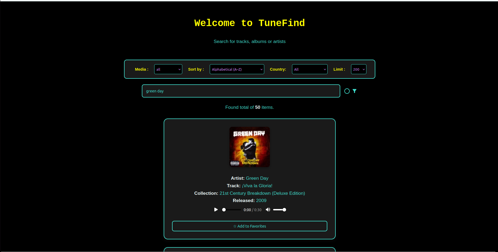

# TuneFind

A React/JS application that uses the iTunes API to search for music tracks, albums, artists, podcasts, and more.

It features real-time search, filtering by media type and country, sorting, and the ability to load more results. Built with modern React tools including **Hooks**, **React Router**, **Material UI**, and **Framer Motion** for subtle animations.





## 🔧 Installation

To run the project locally, follow these steps:

1. **Clone the repository**

```bash
git clone https://github.com/giorgosvs/TuneFind.git
cd TuneFind

#install node js
npm install
npm run dev
